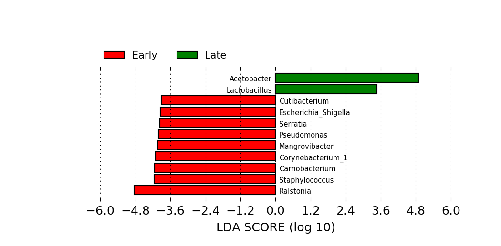
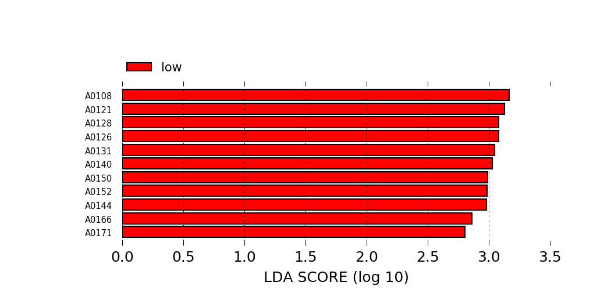
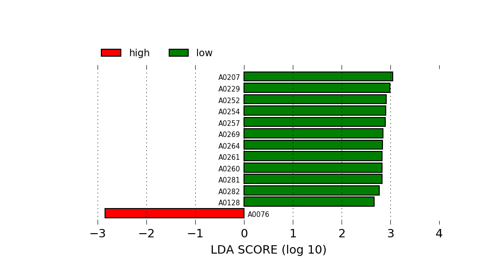

```{r setup, include=FALSE}
knitr::opts_chunk$set(echo = TRUE)
load('../2020-04-22/Diversity.RData')
LH <- read.table('../../data/LifeHistoryVar.txt', header=TRUE, row.names=1)
```

Dr. Amparo Latorre suggested to use Lefse [@Segata2011] to find *biomarkers*
for age (I think) among the amplicons. Lefse implements a linear discriminant
analysis, which can be used to model a categorical variable with a set of
quantitative descriptors [@Legendre2012, p. 616]. There are no categorical
variables among the life-history traits. The only categorical variables we are
using are the *age* (early or late in life), the sequencing batch, and the
isoline. It may be interesting to find amplicons that correlate with any of
these classifications.

Because I am not using isolines's physiological information, I must keep the
177 samples separate, instead of adding up counts from replicates. Thus, I need
to filter amplicons only once, instead of filtering them early and late in life
separately. This time, I will be less permissive: I realize abundances lower
than $10^{-4}$ could easily be dominated by noise.

```{r filtering}
minProp <- 1.0e-04
minPrev <- 5
filter <- ((Traits$EA.meanProp >= minProp & 
            Traits$LA.meanProp >= minProp) |
           (Traits$EA.prevalence >= minPrev &
            Traits$LA.prevalence >= minPrev))
stopifnot(all.equal(rownames(Ar.prop), rownames(SampleData)))
lefseData <- data.frame(
  Age = SampleData$age,
  Batch = SampleData$seqrun,
  Isoline = SampleData$isoline
)
lefseData <- cbind(lefseData, Ar.prop[,filter])
write.table(lefseData, file = 'AmpliconRelativeAbundances.tsv',
            quote = FALSE, sep = '\t', row.names = FALSE,
            col.names = TRUE)
```

I will also create a table with taxa, instead of amplicon, abundances.
That is, I will add up in each sample the abundances of amplicons from
the same species, or genus. There are only 15 amplicons with a species
assigned. And there is only 1 species with more than one amplicon (with 2).
I will use the genus level, and ignore species.

Among the filtered amplicons, there are only `r sum(is.na(Traits[filter, 'Genus']))`
without a genus assigned. I will just remove those, for simplicity.

Splitting data frames, operating with them and then joining the results
back is usually done with the `plyr` package, I think. I can also use
the base `split()` function. In any case, the most common proceadure is
to split the data frame horizontally, by the value of a factor. However,
now I want to group columns, not rows of the `Ar.prop` matrix. The easiest
way is to just transpose it and use `lapply()` and `split()`.

```{r perGenus}
filter2 <- filter & (! is.na(Traits$Genus))
z <- as.data.frame(t(Ar.prop[, filter2]))
Ar.genus <- do.call(rbind, lapply(split(z, Traits[filter2, 'Genus']), colSums))
dim(Ar.genus)
Ar.genus <- t(Ar.genus)
dim(Ar.genus)
# A different way would be something like this:
# z <- lapply(unique(Traits[filter2, 'Genus']),
#            function(x) rowSums(Ar.prop[, rownames(Traits[filter2 & Traits$Genus == x,]), drop=FALSE]))

lefsePerGenus <- data.frame(
  Age = SampleData$age,
  Batch = SampleData$seqrun,
  Isoline = SampleData$isoline
)
lefsePerGenus <- cbind(lefsePerGenus, Ar.genus)
write.table(lefsePerGenus, file = 'GeneraRelativeAbundances.tsv',
            quote = FALSE, sep = '\t', row.names = FALSE,
            col.names = TRUE)
```

# Results

Lefse runs in Galaxy [@Afgan2018]. Here there is a [link](http://huttenhower.sph.harvard.edu/galaxy/u/ignasilucas/h/2020-05-01lefseanalysis)
to the session used to produce the results. I mostly applied default values for the linear
discriminant analysis.

I run the analysis using both amplicons and genera. I include here only one figure from the
analysis with genera, that shows the most characteristic genera at early and late ages.



# Application of Lefse to life-history traits

Life-history traits are not categorical, but we can make them binary in order to use
Lefse to identify the most characteristic amplicons or genera associated with different
vital strategies. In particular, the principal component analysis run by Pau had
produced meaninful 3 first components that can be interpreted as different tradoffs.
Separating isolines according to the sign of their loadings on those principal components
generates meaningful binary classifications amenable to analysis with Lefse.

## PCA of life-history variables

```{r PCA}
LH.pca <- prcomp(~ AvLF + CSearly + CSSlope + EarlyRS + Rsen + ActuarialB,
                 data = LH, na.action = na.omit, center = TRUE, scale. = TRUE)
LH.pca
```

As Pau reported, PC1 is high for flies with high *CSearly* and low *CSSlope*;
that is, high-condition. PC2 is mostly explained by *EarlyRS*; its sign could
be reversed to indicate with positive numbers the isolines with high reproductive
success. And PC3 is mostly explained by *AvLF* and *Rsen*: life span and
reproductive senescence. Changing its sign will make it correlate positively
with both fitness components.

`LH.pca$x` is the matrix of loadings or rotated coordinates of the isolines.
I add to `SampleData` three factors, *PC1*, *PC2* and *PC3*, with two levels
each: high and low. In all cases, *high* indicates the higher fitness side of
the range, according to the interpretation above, whether that means a positive
(PC1) or a negative (PC2 and PC3) value of the loadings.

```{r classification}
SampleData$PC1 <- factor('low', levels=c('low','high'))
SampleData$PC2 <- factor('low', levels=c('low','high'))
SampleData$PC3 <- factor('low', levels=c('low','high'))

highPC1isolines <- rownames(LH.pca$x[LH.pca$x[,'PC1'] > 0,])
highPC2isolines <- rownames(LH.pca$x[LH.pca$x[,'PC2'] < 0,])
highPC3isolines <- rownames(LH.pca$x[LH.pca$x[,'PC3'] < 0,])

SampleData[SampleData$isoline %in% highPC1isolines, 'PC1'] <- 'high'
SampleData[SampleData$isoline %in% highPC2isolines, 'PC2'] <- 'high'
SampleData[SampleData$isoline %in% highPC3isolines, 'PC3'] <- 'high'
```

```{r amplicons}
lefsePC1.amplicons <- data.frame(
  PC1 = SampleData$PC1,
  Age = SampleData$age
)
lefsePC1.amplicons <- cbind(lefsePC1.amplicons, Ar.prop[, filter])

lefsePC2.amplicons <- data.frame(
  PC2 = SampleData$PC2,
  Age = SampleData$age
)
lefsePC2.amplicons <- cbind(lefsePC2.amplicons, Ar.prop[, filter])

lefsePC3.amplicons <- data.frame(
  PC3 = SampleData$PC3,
  Age = SampleData$age
)
lefsePC3.amplicons <- cbind(lefsePC3.amplicons, Ar.prop[, filter])

write.table(lefsePC1.amplicons, file='lefsePC1_amplicons.tsv', quote=FALSE,
            row.names=FALSE, col.names=TRUE, sep='\t')
write.table(lefsePC2.amplicons, file='lefsePC2_amplicons.tsv', quote=FALSE,
            row.names=FALSE, col.names=TRUE, sep='\t')
write.table(lefsePC3.amplicons, file='lefsePC3_amplicons.tsv', quote=FALSE,
            row.names=FALSE, col.names=TRUE, sep='\t')
```

```{r genera}
lefsePC1.genus <- data.frame(
  PC1 = SampleData$PC1,
  Age = SampleData$age
)
lefsePC1.genus <- cbind(lefsePC1.genus, Ar.genus)

lefsePC2.genus <- data.frame(
  PC2 = SampleData$PC2,
  Age = SampleData$age
)
lefsePC2.genus <- cbind(lefsePC2.genus, Ar.genus)

lefsePC3.genus <- data.frame(
  PC3 = SampleData$PC3,
  Age = SampleData$age
)
lefsePC3.genus <- cbind(lefsePC3.genus, Ar.genus)

write.table(lefsePC1.genus, file = 'lefsePC1_genus.tsv', quote = FALSE,
            row.names = FALSE, col.names = TRUE, sep = '\t')
write.table(lefsePC2.genus, file = 'lefsePC2_genus.tsv', quote = FALSE,
            row.names = FALSE, col.names = TRUE, sep = '\t')
write.table(lefsePC3.genus, file = 'lefsePC3_genus.tsv', quote = FALSE,
            row.names = FALSE, col.names = TRUE, sep = '\t')
```

# Lefse results on *binarized* life-history components

Lefse did not find any genus significantly associated with any of the three
first principal components of life-history traits. In the case of amplicons,
only PC1 and PC3 seem to have some amplicons associated mostly with the low 
levels.

The Galaxy session is visible [here](http://huttenhower.sph.harvard.edu/galaxy/u/ignasilucas/h/unnamed-history).





```{r whatisit}
PC1low <- c('A0108','A0121','A0128','A0126','A0131','A0140',
            'A0150','A0152','A0144','A0166','A0171')
PC3low <- c('A0207','A0229','A0252','A0254','A0257','A0269',
            'A0264','A0261','A0260','A0281','A0282','A0128')
PC3high <- 'A0076'

Traits[PC1low,]
Traits[PC3low,]
Traits[PC3high,]
```

They all are different *Acetobacter* amplicons. It would not be dificult to
show them in a phylogenetic tree of all *Acetobacter* amplicons, using the
`picante` package.

```{r sessionInfo}
sessionInfo()
```

# References

